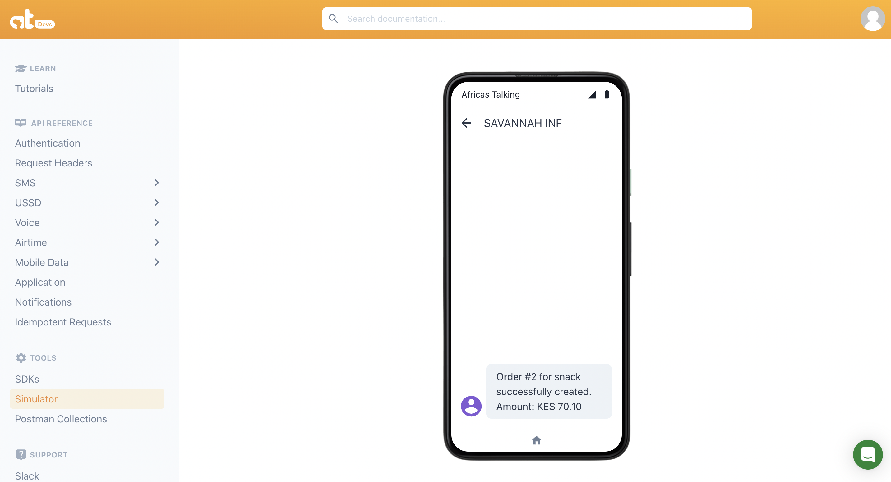

# Savannah-Informatics

Savannah-Informatics is a web application that manages customer and order data, and integrates with the Africa's Talking SMS API to send SMS notifications. It uses the Gin framework for routing, PostgreSQL for data storage, and integrates with Africa's Talking for SMS functionality.

## Installations

Before you run the application, make sure the following dependencies are installed:

Go: Go programming language (v1.18 or above).

PostgreSQL: Database to store customers and orders.

Gin Framework: HTTP web framework for Go.

To install Go and PostgreSQL, follow the installation guides available on their official websites.

## Dependencies

Install required dependencies using go get:

    go get -u github.com/gin-gonic/gin

For Africa's Talking SMS API, use:

    go get github.com/AfricasTalkingLtd/africastalking-go

OR

    go get . //to install all dependencies

## API Endpoints

### /customers

POST: Create a new customer.

Request Body Example:

    {
        "code": "rsfrshdd",
        "full_name": "ekreykrt",
        "phone": "72734"
    }

Response Example:

    {
        "cust_id": 1,
        "code": "rsfrshdd",
        "full_name": "ekreykrt",
        "phone": "72734"
    }

### /orders

POST: Create a new order.

Request Body Example:

    {
        "item": "snack",
        "amount": 70.1,
        "cust_id": 1
    }

Response Example:

    {
        "order_id": 2,
        "item": "snack",
        "time": "0000-01-01T00:00:00Z",
        "amount": 70.1,
        "cust_id": 1
    }

## Testing API

The application’s API endpoints can be tested using Postman. Make sure to provide the correct request body in JSON format as shown in the examples above.

## Running the Application

To run the application:

    go run main.go

This will:

Connect to the PostgreSQL database hosted at localhost:5432 and use a PostgreSQL database named savannah.
Serve HTTP requests on localhost:8080.
Make sure you have the required PostgreSQL database and tables created, and set up the proper credentials for your database connection.

## Continous Integration/Continous Deployment (CI/CD)

This project uses GitHub Actions and Render for automated CI/CD workflows.

### GitHub Actions for CI

CI Workflow: The project includes a GitHub Actions workflow (.github/workflows/go.yml) that run automatically:

How to use:

Push changes to the main branch.
Monitor the workflow status in the GitHub Actions tab of the repository.

### Render for CD

CD Workflow: Render is used to host and deploy the application. Changes pushed to the main branch are automatically deployed to the Render service.

Configuration:

Deployment configuration is defined in the render.yaml file.
Environment variables for the deployment are managed via the Render dashboard or the render.yaml file.

How to deploy:

Push changes to the GitHub repository.
Render will build, upload, and deploy the latest version of the application.

## Screenshots

[sms sending](https://imgur.com/a/LDe6qAP)

## License

This project is licensed under the [MIT License](LICENSE).

